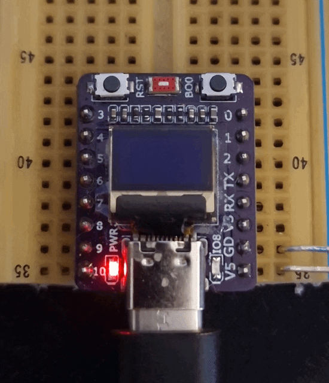
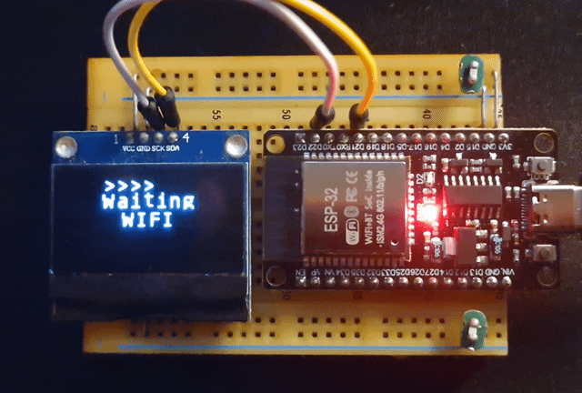
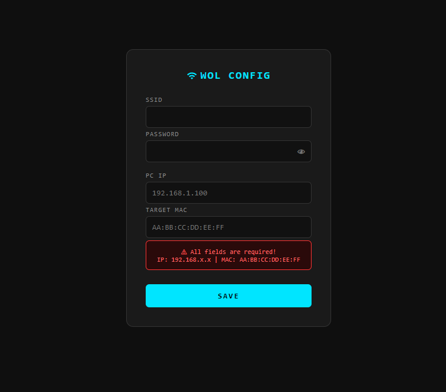
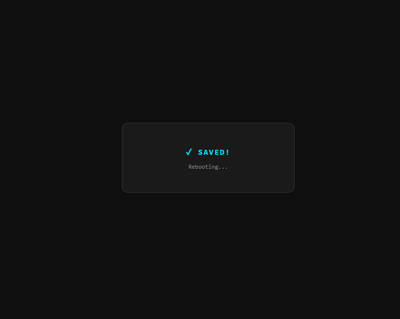

# Wake-on-LAN for ESP32 (Zephyr RTOS)

<p align="center">
  
  
</p>

<p align="center">
  <i>A Zephyr RTOS port and enhancement of the original <a href="https://github.com/sergio-isidoro/Wake-on-LAN_ESP32">Wake-on-LAN_ESP32</a></i>
</p>

---

## 📝 Description
This project provides a complete, robust, and asynchronous **Wake-on-LAN (WoL)** solution for the **ESP32-C3 SuperMini** and **ESP32 DevKitC**. It features a captive portal for easy configuration, persistent storage (NVS), and a UI for SSD1306 OLED displays.

---

## ✨ Key Features

* **Captive Portal Configuration:** No need to hardcode credentials. If no config is found, the device starts an Access Point (`WOL_ESP`) with a DNS redirector and HTTP server.
* **Persistent Storage (NVS):** Wi-Fi credentials, Target MAC, and Target IP are saved securely in the ESP32 internal Flash.
* **Factory Reset:** A hardware-based reset to wipe all saved settings and return to Portal Mode.
* **System Reliability:**
    * **Hardware Watchdog (WDT):** 1.5-second timeout to automatically recover from network hangs.
    * **Asynchronous Workqueues:** WoL packet dispatch and ICMP Ping checks are offloaded from ISRs for maximum stability.
* **OLED UI (SSD1306):** Supports both **0.42" (72x40)** and **1.30" (128x64)** screens.
    * **Smart IP Filtering:** Displays only the relevant last two octets to fit the screen.
    * **Heartbeat Animation:** A dynamic `>>>>>>>` indicator shows the system is active.

---

## 🖥️ User Interface & States

### 1. Portal Mode (Initial Setup)
Connect to Wi-Fi `WOL_ESP` and access `192.168.4.1`.

<p align="center">
    
</p>

| Line | Content | Description |
| :---: | :---: | :--- |
| **Top** | `WOL_ESP` | Static header for Configuration Mode |
| **Middle** | `192.168` | Portal IP (Part 1) |
| **Bottom** | `.4.1` | Portal IP (Part 2) |

### 2. Connecting Mode
<p align="center">
  
</p>

| Line | Content | Description |
| :---: | :---: | :--- |
| **Top** | `>>>>>>>` | Activity heartbeat |
| **Middle** | `Waiting` | Status message |
| **Bottom** | `WIFI` | **Ideal time to trigger Factory Reset** |

### 3. Operation Mode (Station)
<p align="center">
  
</p>

| Line | Content | Description |
| :---: | :---: | :--- |
| **Top** | `>>>>>>>` | Real-time refresh indicator |
| **Middle** | `1.111` | ESP32 IP (Last two octets, e.g., .**1.111**) |
| **Bottom** | `* 1.222` | `*` = Online / `x` = Offline + Target PC IP |

---

## 🔄 Reset Procedures (Factory Reset)

<p align="center">
  
</p>

If you need to change the network or target details, you can force the device back into **Portal Mode**:

1.  **When to press:** Power on or reboot the device.
2.  **The Trigger:** As soon as the display shows **`Waiting WIFI`**, press and hold the **BOOT button**.
3.  **Duration:** Keep pressed for **1 second**.
4.  **Confirmation:** Settings are erased, and the device reboots into Portal Mode (`WOL_ESP`).

Alternatively, erase the NVS partition directly via esptool:
```bash
esptool.py erase_region 0x3f0000 0x10000
```

---

## 🛠️ Hardware Requirements

### ESP32-C3 SuperMini
| Component | Detail |
| :--- | :--- |
| **Display** | 0.42" OLED SSD1306 via I2C (**SDA: GPIO 5, SCL: GPIO 6**) |
| **LED** | Internal Blue LED on **GPIO 8** |
| **Button** | BOOT button on **GPIO 9** (Trigger WoL / Factory Reset) |

### ESP32 DevKitC
| Component | Detail |
| :--- | :--- |
| **Display** | 1.30" OLED SSD1306 via I2C (**SDA: GPIO 21, SCL: GPIO 22**) |
| **LED** | Blue LED on **GPIO 2** |
| **Button** | BOOT button on **GPIO 0** (Trigger WoL / Factory Reset) |

> **Target PC:** Must support WoL and allow ICMP Echo Requests (Ping).

---

## 📂 Project Structure

```
.
├── src/
│   ├── main.c          # Core orchestration, Reset logic, and Watchdog
│   ├── portal.c        # Captive Portal (DNS Redirector + HTTP Server)
│   ├── storage.c       # NVS Flash management for persistence
│   ├── wifi.c          # Wi-Fi connectivity, DHCP, and ICMP Ping task
│   ├── display.c       # Multithreaded OLED rendering
│   ├── button.c        # GPIO interrupt handling
│   └── notify.c        # LED patterns and UI refresh synchronization
├── inc/
│   └── *.h
├── esp32c3_supermini.overlay   # Devicetree for ESP32-C3 SuperMini
└── esp32_devkitc.overlay       # Devicetree for ESP32 DevKitC
```

---

## 🚀 Quick Start

### ESP32-C3 SuperMini
```bash
west build -p always -b esp32c3_supermini .
west flash
```

### ESP32 DevKitC
```bash
west build -p always -b esp32_devkitc/esp32/procpu .
west flash
```

---

## 🔧 Build Environment

| Tool | Version |
| :--- | :--- |
| **Zephyr RTOS** | 4.3.0 |
| **Zephyr SDK** | 0.17.3 |
| **West** | latest |
